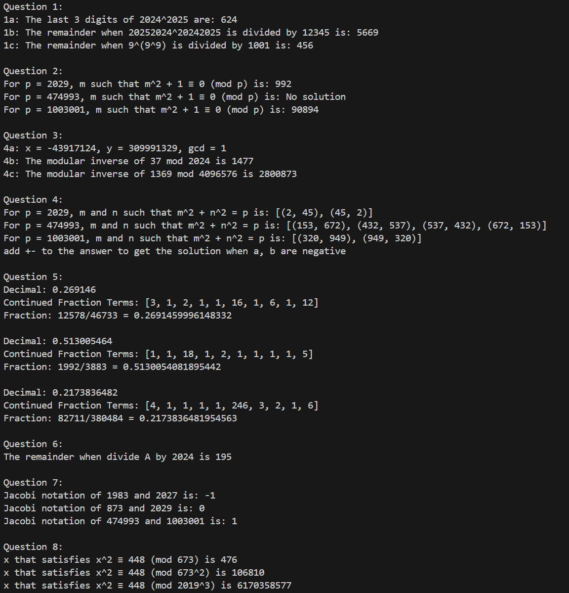

# MTH346_LabWork

## How to run?
- Install Python
### Run each file
- Navigate to file P{i}.py and run normally (i is from 1 to 10)
### Run multiple files
- Navigate to main.py and run normally.

## Result
- When running main.py, the result will be as below image:
